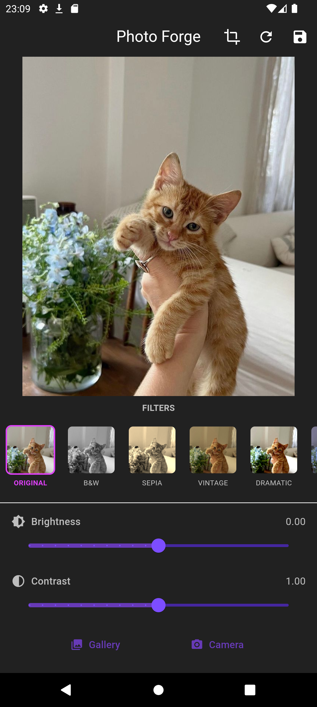
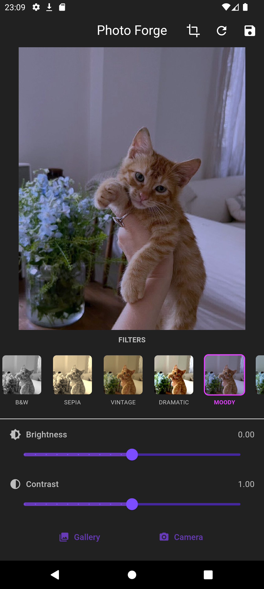

# Photo Forge - Image Editing App 📸✨


Photo Forge is a powerful yet simple mobile application for editing your photos with beautiful filters and precise adjustments. Built with Flutter, it offers a smooth cross-platform experience.

Available on the Play Store.


## Features 🌟

### 📁 Image Selection
- Pick images from gallery or camera
- Interactive image viewer with pinch-to-zoom
- Supports high-resolution images

### 🎨 Editing Tools
- **10+ Artistic Filters**: Vintage, Black & White, Dramatic, and more
- **Precise Adjustments**:
  - Brightness (-1.0 to +1.0)
  - Contrast (0.0 to 2.0)
  - Saturation (0.0 to 2.0)
  - Warmth (-1.0 to +1.0)
  - Vignette (0.0 to 1.0)
- **Cropping Tool**: Free-form and aspect ratio cropping
- **One-tap Reset**: Revert to original image

### 💾 Output
- Save to device gallery with original quality
- Preserves EXIF data

## Screenshots 📱

| Home Screen | Filters | Adjustments |
|-------------|---------|-------------|
|  |  |  |

## Installation ⚙️

### From Play Store
[](https://play.google.com/store/apps/details?id=com.cloudsoftware.photoforge)


### From source
1. Clone the repository:
   ```bash
   git clone https://github.com/cloudsoftwareoff/photoforge.git
   ```
2. Install dependencies:
    ```bash
    flutter pub get
    ```
3. Run the app
    ```bash
    flutter run
    ```

# License
MIT License

Copyright (c) 2023 CloudSoftware

Permission is hereby granted, free of charge, to any person obtaining a copy
of this software and associated documentation files (the "Software"), to deal
in the Software without restriction, including without limitation the rights
to use, copy, modify, merge, publish, distribute, sublicense, and/or sell
copies of the Software, and to permit persons to whom the Software is
furnished to do so, subject to the following conditions:

The above copyright notice and this permission notice shall be included in all
copies or substantial portions of the Software.

THE SOFTWARE IS PROVIDED "AS IS", WITHOUT WARRANTY OF ANY KIND, EXPRESS OR
IMPLIED, INCLUDING BUT NOT LIMITED TO THE WARRANTIES OF MERCHANTABILITY,
FITNESS FOR A PARTICULAR PURPOSE AND NONINFRINGEMENT. IN NO EVENT SHALL THE
AUTHORS OR COPYRIGHT HOLDERS BE LIABLE FOR ANY CLAIM, DAMAGES OR OTHER
LIABILITY, WHETHER IN AN ACTION OF CONTRACT, TORT OR OTHERWISE, ARISING FROM,
OUT OF OR IN CONNECTION WITH THE SOFTWARE OR THE USE OR OTHER DEALINGS IN THE
SOFTWARE.
© 2025 CloudSoftware. All rights reserved.